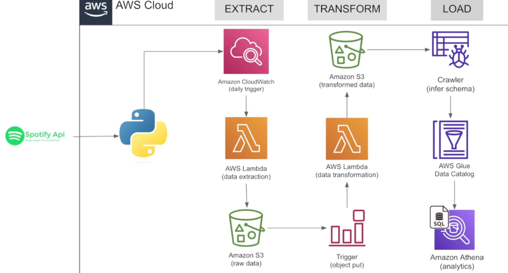

# Data Pipeline for spotify top 50 Global Hits:

## Introduction
This Project contains a data pipeline that extracts monthly Spotify's Global Top 50 playlist, transforms it, and loads it into an S3 data lake. The pipeline leverages Python, AWS Lambda, S3, Glue, CloudWatch, and Athena for efficient data ingestion and analysis.

## Architecture

## Tech Stack
- Programming Language: Python
- Scripting Lanuage: SQL
- Amazon Web Services:
  * AWS Lambda
  * AWS S3
  * AWS Glue
  * AWS Cloudwatch
  * AWS Athena
 
## Contribute to this project: 

## Dataset Used
Top 50 - Global spotify plalist: 
Original Data Source: https://open.spotify.com/playlist/37i9dQZEVXbMDoHDwVN2tF (data pipeline extracts live data from this link)

### More info about Datasets:

## Scripts Used:
1. [Spotify Data Pipeline Project](main/Spotify Data Pipeline Project.ipynb)

## Steps Involved

1. First step is extracting data from api for spotify;
[developer.spotify.com](https://developer.spotify.com/dashboard)
Click create app,
We have clientid and secretid, write & save them.

2. Now go to jupyter notebook or any open source python IDE:
install spotipy there using: !pip install spotipy
 
Read detailed documentation on it: [spotipy.readthedocs](https://spotipy.readthedocs.io/en/2.24.0/)
, it has all the functions which we will use to extract the data

3. write the python scripts for that [TOP 50 Global Spotify](https://open.spotify.com/playlist/1KNl4AYfgZtOVm9KHkhPTF)
   
exctrating Json data from global top hitz using global top 50 link from spotify using this link then doing python operations and working on it.

4. Go to Amazon S3, we will create a bucket

Under spotify etl project in S3 create subfolders; as raw_data & transformed_data
  
5.  Now open Lambda in new new tab,
Click on Create function inside Lambda,
Then, name it, select python latest version as runtime, click create fn, our fn is created.

Then,
click on config >> env variables >> open python code window side by side >> copy the env variables, 
 
Now save these crucial info like clientId and secretId in the back end, so that you don’t have to use it in your code, and can directly access the var and do it when we need.

After adding the python code click deploy,
Then click test, click configure test event, name it as test save,

Need to create Iam roles respectively, based in the communications
Attach policy
Then once all errors are gone we can,

Now to check ur s3, u have the data to be processed in s3.
Then we can move the data, from to prpcessed to processed. 

